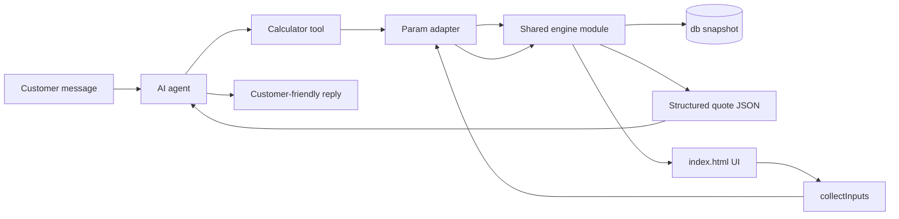

# AI Agent Integration — Code Inspection Report

**Date:** August 12, 2026  
**Scope:** Architecture inspection only — no application code changes  
**Repository:** Printing-Production-Calculator

---

## Executive Summary

This is a **single-file monolith**: all UI, state, database, and calculation logic live in `index.html` (~3,200 lines), with one regression test file at `tests/calculation-regression.mjs`. There is no build step, no package.json, and pricing data is stored in a global `db` object backed by `localStorage`.

The codebase is **ready for AI integration** because:

1. Core layout math is already isolated into named functions
2. A structured `lastQuotePayload` output already exists
3. Regression tests validate extraction without duplicating formulas
4. The main gap is **DOM reads inside orchestration functions** — not missing math

The smallest safe next step: **extract pure functions → add one parametric `quoteDigital()` for Konica stickers → wire UI to call it → expose the same function as an AI tool.** No formula changes required.

---

## 1. Current Calculation Architecture

```mermaid
flowchart TB
  subgraph UI["Browser UI (index.html)"]
    DOM[Form inputs + selects]
    CALC[calculate()]
  end

  subgraph Digital["Digital Path"]
    CD[calculateDigital]
    CDL[calculateDigitalLayout]
    CDR[calculateDigitalRollLayout]
    CRPC[calculateRollPanelCandidate]
    CCSL[calculateCustomerSheetLayout]
    DCG[digitalCountGrid]
    RDP[resolveDigitalPricing]
  end

  subgraph Offset["Offset Path"]
    CO[calculateOffset]
    CB[chooseBest / candidate]
    BP[bestPack]
    FC[fullCost]
  end

  subgraph Data["Shared State"]
    DB[(db in localStorage)]
    LQP[lastQuotePayload]
  end

  DOM --> CALC
  CALC -->|printingMethod=digital| CD
  CALC -->|printingMethod=offset| CO
  CD --> CDL
  CDL -->|Epson roll| CDR --> CRPC --> CCSL --> DCG
  CDL -->|Konica sheet| DCG
  CD --> RDP
  CO --> CB --> BP
  CB --> FC
  DB --> CD
  DB --> CO
  CD --> LQP
  CO --> LQP
  CD --> DOM
  CO --> DOM
```

### Entry Point

`calculate()` dispatches by `printingMethod`:

```javascript
function calculate(){
 syncMethodUI();
 if(val('printingMethod')==='digital')calculateDigital();
 else calculateOffset();
}
```

### Shared Database (`db`)

Stored in `localStorage` under key `offset_printing_prod_v28`. Collections:

| Collection | Purpose |
|---|---|
| `products` | Product types (Sticker, Flyer, etc.) with method availability and pricing mode |
| `papers` | Media presets (offset sheets, Konica sheets, Epson rolls) |
| `machines` | Komori 26, Komori L440, Konica, Epson S80670 |
| `cuts` | Offset cut sizes (original → cut sheet mappings) |
| `rates` | Offset printing rates per machine + cut size |
| `digitalRates` | Digital printing cost per sheet/side |
| `digitalPriceTiers` | Fixed Konica tier pricing (product + media + min sheets) |
| `capacities` | Stack capacity by GSM |
| `laminations` | Lamination rate per sq.in |
| `printingPolicy` | Offset printing round thresholds |

### Structured Output

Both calculators populate `lastQuotePayload` — a JSON-serializable quote object accessible via `getCurrentQuotePayload()`.

---

## 2. Important Functions and Dependencies

### Layout / Packing (Pure — No DOM, No db)

| Function | Role |
|---|---|
| `packGrid()` | Grid packing with optional rotation |
| `packArea()` | Pack within a sub-area |
| `packGuillotine()` | Vertical/horizontal guillotine splits |
| `bestPack()` | Best of grid + guillotine (offset cut→product layout) |
| `digitalCountGrid()` | Grid or honeycomb layout (stickers, ovals) |
| `calculateCustomerSheetLayout()` | Usable area + insets + optional artwork rotation |
| `calculateRollPanelCandidate()` | One roll column candidate (panels, remainder, billing) |
| `epsonBillingPolicy()` / `rollBillableSqft()` | Epson block billing |

These are **already regression-tested** by extracting source from `index.html` in `tests/calculation-regression.mjs`.

### Digital Layout Orchestration (DOM-Coupled)

| Function | Reads from DOM | Reads from db |
|---|---|---|
| `calculateDigitalLayout()` | finished size, bleed, gap, margins, split, shape, rotate, qty, unit | via `selectedDigitalMedia()`, `selectedDigitalMachine()` |
| `calculateDigitalRollLayout()` | qty, panel gap, customer sheet W/H, rotate, shape, layout, production qty mode | media, machine |
| `calculateDigital()` | all of above + profit margin, print sides | product, media, machine, tiers, rates |

**Digital layout branch:**

```javascript
function calculateDigitalLayout(){
 const media=selectedDigitalMedia(),machine=selectedDigitalMachine();
 // ... reads W, H, margins, finishedW/H, bleed, gap from DOM ...
 if(media&&machine&&isRollMachine(machine)){
  const roll=calculateDigitalRollLayout(media,machine,W,originalW,originalH,layoutGap);
  return{...roll,bleed,cutW,cutH};
 }
 // Konica sheet path: digitalCountGrid + split panels
 // ...
}
```

### Digital Pricing (db-Only, Parametric-Ready)

| Function | Depends on |
|---|---|
| `resolveDigitalPricing(product, media, machine, sheets)` | db + product config |
| `digitalRateFor(machine)` | `db.digitalRates` |
| `digitalTierFor(product, media, machine, sheets)` | `db.digitalPriceTiers` |

Three pricing modes:

- **`fixed_sheet_tier`** — Konica stickers/warranty seals (tier by min sheets)
- **`sell_sqft`** — Epson roll (media `sellRateSqft` × billable sqft)
- **`cost_plus`** — media cost + printing rate × sides + markup

### Offset Calculation (Mostly DOM-Coupled)

| Function | Role |
|---|---|
| `productInches()` | Reads finishedW/H, bleed, unit from DOM |
| `candidate(p, c, m)` | One cut-size scenario: layout + paper + printing cost |
| `chooseBest(p, m)` | Iterates `db.cuts`, picks lowest `fullCost` |
| `fullCost(item, p, m)` | Plate, cutting, die, lamination, other costs |
| `rateFor(m, c)` | Looks up `db.rates` |
| `printingRounds(sheetQty)` | Uses `db.printingPolicy` |
| `knifePlan()` / `laminationCost()` | Read cutting/lamination mode from DOM |

**Offset flow:**

```javascript
function calculateOffset(){
 // ...
 const p=selectedPaper(),m=selectedMachine();
 const item=val('cutMode')==='auto'?chooseBest(p,m):candidate(p,db.cuts[Number(val('cutSelect'))],m);
 // ... cost assembly + DOM updates ...
}
```

---

## 3. Calculations Tightly Coupled to the DOM

### Hard DOM Coupling (Cannot Run Headless Without Adaptation)

| Area | DOM Dependencies |
|---|---|
| Input helpers | `$()`, `num(id)`, `val(id)` — all form reads |
| Entity selection | `selectedPaper()`, `selectedDigitalMedia()`, `selectedDigitalMachine()`, `selectedLamination()`, `currentProductType()` — read `<select>` indices |
| `productInches()` | `finishedW`, `finishedH`, `bleed`, `unit` |
| `calculateDigitalLayout()` | ~15 form fields (media W/H, margins, split, gap, shape, rotate, qty) |
| `calculateDigitalRollLayout()` | `qty`, `digitalPanelGap`, `digitalCustomerSheetW`, `digitalRotate`, `digitalShape`, `digitalLayout`, production qty manual mode |
| `calculateDigital()` | All layout inputs + profit margin, print sides; writes ~40 DOM elements |
| `calculateOffset()` | qty, waste, colors, cut mode, knife/die/lamination modes, profit margin; writes ~30 DOM elements |
| `candidate()` | `productInches()`, `shapeGap`, `productUpMode`, `manualProductUp`, `qty`, `waste`, color counts |
| Canvas/preview | `drawDigitalPreview()`, `drawDigitalRollPreview()`, `draw()` — pure rendering, not calculation |

### Soft Coupling (Global State, Not DOM)

| Global | Used For |
|---|---|
| `db` | All pricing, media, machines, cuts |
| `lastDigitalRollResult` | Roll split UI state between recalculations |
| `lastQuotePayload` | Structured quote cache |
| `localStorage` | Persistence |

---

## 4. What Can Already Be Reused as Pure Calculation Logic

### Fully Reusable Today (Inputs → Outputs, No Side Effects)

```
packGrid, packArea, packGuillotine, bestPack
digitalCountGrid
calculateCustomerSheetLayout
calculateRollPanelCandidate
epsonBillingPolicy, rollBillableSqft, defaultEpsonBillingPolicy
machineFits, printableArea
printingRounds (needs policy object)
resolveDigitalPricing, digitalRateFor, digitalTierFor
rateFor, capacityFor (given db + params)
knifePlan (given item.pack — no DOM if pack is passed in)
```

### Reusable with a Thin Parametric Wrapper (Logic Exists, But Reads DOM Today)

| Current Function | What a Wrapper Would Accept Instead of DOM |
|---|---|
| `candidate()` | `{ finishedW, finishedH, bleed, unit, shapeGap, qty, waste, productUpMode, frontColors, backColors }` + db refs |
| `chooseBest()` | paper + machine + above params |
| `calculateDigitalLayout()` | explicit `{ media, machine, W, H, margins, split, gap, shape, layout, rotate, qty, unit, ... }` |
| `calculateDigitalRollLayout()` | same + `{ panelGap, customerW, customerH, productionQty }` |
| Pricing block inside `calculateDigital()` | layout result + `{ product, media, machine, profitMargin, printSides }` |
| Pricing block inside `calculateOffset()` | candidate result + finishing options |

### Already Partially Designed for Reuse

`lastQuotePayload` is the structured result shape the AI layer wants:

```javascript
lastQuotePayload={
  version:1,mode:'digital',currency:'MMK',
  product:{name,shape,unit,width,height,bleed,gap},
  media:{name,route,machine},
  request:{orderPcs},
  production:{unit,quantity,piecesPerUnit,expectedDelivery,extraPieces},
  pricing:{model,total,perPiece,billable,billableUnit}
};
```

The regression test proves the **extract-without-duplicating** pattern works — it reads function bodies from `index.html` rather than maintaining a second copy of formulas.

---

## 5. Risks of Extracting the Calculation Engine

| Risk | Severity | Detail |
|---|---|---|
| Formula drift | **High** | Two copies of logic would diverge; must keep a single source of truth |
| Hidden DOM reads | **High** | `calculateDigitalLayout()` and `calculateDigitalRollLayout()` call `num()`/`val()` deep inside — easy to miss during extraction |
| Global `db` mutation | **Medium** | `saveDB()`, `cleanupOrphanData()`, migrations run at load — engine must receive immutable snapshots |
| Roll UI state leakage | **Medium** | `lastDigitalRollResult`, `activeRollPanelKey`, manual production qty mode affect roll calculations |
| Unit conversion | **Medium** | mm/inch handled inline via `val('unit')`; AI must pass consistent units |
| Select-by-index media lookup | **Medium** | `selectedDigitalMedia()` uses DOM select index into `db.papers` — AI needs name/id lookup instead |
| Pricing mode matrix | **Medium** | 3 digital + offset cost-plus paths; AI tool must route correctly |
| Regression test fragility | **Low–Medium** | Current test parses `index.html` by brace counting — works but brittle if functions are renamed/reordered |
| No TypeScript/schemas | **Low** | Params are untyped objects; AI tool calls need explicit JSON schemas |

**Safest extraction principle:** extract functions verbatim (move, don't rewrite), then add parametric wrappers that the UI calls instead of reading DOM directly.

---

## 6. Smallest Safe Architecture for AI Integration



### Minimal Layers (3 Files + Thin UI Change)

1. **`calculator/engine.js`** — move existing pure functions unchanged (`bestPack`, `digitalCountGrid`, `calculateCustomerSheetLayout`, `calculateRollPanelCandidate`, pricing helpers, etc.)

2. **`calculator/quote-digital.js`** — parametric `quoteDigital(params, db)` that mirrors `calculateDigital()` logic but takes a params object and returns `{ layout, pricing, quotePayload }` with zero DOM access

3. **`calculator/quote-offset.js`** — same for offset (can come later)

4. **`index.html` change** — `calculateDigital()` becomes: `collectDigitalParamsFromDOM()` → `quoteDigital(params, db)` → `renderDigitalResults(result)`

5. **AI tool** — calls `quoteDigital(params, db)` with the same params schema; formats `quotePayload` into natural language

**Key constraint satisfied:** UI and AI call the **same function** with the **same db snapshot**. No formula duplication.

### Future AI Flow

```
Customer message
  → AI
  → choose appropriate calculator tool
  → existing calculation engine
  → structured result
  → AI customer-friendly response
```

---

## 7. Recommended First Calculator for AI PoC

**Konica sticker sheet** (digital, non-roll, `fixed_sheet_tier` pricing)

### Why This One First

| Factor | Konica Sticker | Epson Roll | Offset |
|---|---|---|---|
| Layout purity | `calculateCustomerSheetLayout` is fully pure | Roll path has DOM reads in `calculateDigitalRollLayout` | `candidate()` reads DOM via `productInches()` |
| Pricing complexity | Fixed tier lookup — deterministic | Block sqft billing + remainder strips | Auto cut selection + plate/cutting/die/lam |
| Regression coverage | ✅ tested (13×19, 3.2″ artwork) | ✅ tested but more edge cases | ❌ not in regression tests |
| Business value | High — stickers are a common AI chat query | High but harder | Complex multi-step |
| AI param surface | ~10 fields (size, qty, media, product) | ~15+ fields (roll split, panel gap, remainder) | ~20+ fields |

### PoC Tool Signature (Conceptual)

```javascript
quoteKonicaSticker({
  productName: "Sticker",
  mediaType: "PP Matte or Gloss Sticker",
  finishedWidth: 50,
  finishedHeight: 50,
  unit: "mm",
  bleed: 1,
  gap: 0,
  shape: "rect",
  layout: "grid",
  qty: 100
}, db)
```

Returns the same shape as `lastQuotePayload` plus layout details (pieces/sheet, sheets needed, tier price, total, per-piece).

---

## 8. Exact Files to Add or Modify (Next Step)

### Add (New Files)

| File | Purpose |
|---|---|
| `calculator/engine.js` | Pure layout + billing + pricing lookup functions (moved verbatim from `index.html`) |
| `calculator/quote-digital.js` | `collectDigitalParams`-shaped input → `quoteDigital(params, db)` → structured result |
| `calculator/db-utils.js` | `findMediaByType()`, `findMachineByName()`, `findProductByName()` — replaces select-by-index lookups |
| `calculator/schemas/digital-sticker.schema.json` | JSON schema for AI tool parameters (optional but recommended) |
| `tests/quote-digital.test.mjs` | End-to-end quote tests against known sticker scenarios |

### Modify (Existing Files)

| File | Change |
|---|---|
| `index.html` | `<script type="module">` import from `calculator/`; replace inline function bodies with imports; `calculateDigital()` calls `quoteDigital(collectFromDOM(), db)` then renders |
| `tests/calculation-regression.mjs` | Import from `calculator/engine.js` instead of parsing `index.html` (keeps single source of truth) |

### Do NOT Modify Yet

- No OpenAI/API files
- No chat UI
- No formula changes inside existing functions
- No refactoring of offset or roll paths until sticker PoC is validated

---

## Calculation Flow Summaries

### 1. Digital Printing (Konica Sheet)

```
finished size + bleed
  → digitalCountGrid on usable panel area
  → mediaNeeded = ceil(qty / piecesPerMedia)
  → resolveDigitalPricing
  → tier or cost-plus
  → lastQuotePayload
```

**Key functions:** `calculateDigitalLayout()` → `digitalCountGrid()` → `resolveDigitalPricing()` → `calculateDigital()`

### 2. Offset Printing

```
productInches()
  → for each cut in db.cuts: bestPack on cut sheet
  → chooseBest by total cost
  → paper + printing rounds + plate + cutting/die/lamination
```

**Key functions:** `calculateOffset()` → `chooseBest()` / `candidate()` → `bestPack()` → `fullCost()`

### 3. Sticker / Sheet Layout

```
calculateCustomerSheetLayout(panelW, panelH, insets, artworkW, artworkH, gap, shape, layout, allowRotate)
  → delegates to digitalCountGrid (grid or honeycomb for ovals)
```

**Key functions:** `calculateCustomerSheetLayout()` → `digitalCountGrid()`

Used for:
- Konica sticker sheets (13×19 with margins)
- Roll panel columns (each column is a "customer sheet")

### 4. Roll Media / Epson Layout

```
finished size + bleed
  → calculateRollPanelCandidate (columns, remainder strip)
  → rollBillableSqft
  → sellRateSqft × billable
  → roll-row production counts
```

**Key functions:** `calculateDigitalRollLayout()` → `calculateRollPanelCandidate()` → `calculateCustomerSheetLayout()` → `epsonBillingPolicy()` / `rollBillableSqft()`

---

## Regression Test Coverage

File: `tests/calculation-regression.mjs`

Run with: `node tests/calculation-regression.mjs`

Currently tested scenarios:

| Test | Function(s) | Assertion |
|---|---|---|
| 50-inch Epson billing policy | `epsonBillingPolicy`, `rollBillableSqft` | 4 sqft / 12-inch row |
| 59.84-inch Epson billing policy | `epsonBillingPolicy`, `rollBillableSqft` | 5 sqft / 12.45-inch row |
| Offset best-fit packing | `bestPack` | 31×43 sheet → 12 × 10-inch products |
| 12×12 customer panel | `calculateCustomerSheetLayout` | 9 × 3.2-inch artwork (3×3 grid) |
| 48.5-inch roll column split | `calculateRollPanelCandidate` | 4 equal 11.875-inch columns |
| 59.8-inch roll two-column split | `calculateRollPanelCandidate` | Two 29.35-inch columns with 0.1-inch gap |
| Konica 13×19 margin-free sheet | `calculateCustomerSheetLayout` | 20 × 3.2-inch artwork |

**Not yet tested:** full end-to-end quote paths (`calculateDigital`, `calculateOffset`), pricing assembly, offset cost calculation.

---

## Constraints for Future Work

These constraints must be preserved throughout AI integration:

- **Do not change any existing calculation formulas**
- **Do not duplicate pricing or calculation logic**
- **Do not refactor the whole app**
- **Preserve the current calculator behavior exactly**
- **Current UI and future AI agent must use the SAME calculation logic and pricing data**

---

## Bottom Line

The extraction path is clear and low-risk if done incrementally:

1. Move pure functions to `calculator/engine.js` (verbatim, no rewrites)
2. Add parametric `quoteDigital(params, db)` for Konica sticker PoC
3. Wire `index.html` to call the shared function
4. Expose the same function as an AI tool
5. Expand to roll and offset paths once sticker PoC is validated

No OpenAI integration, no chat UI, and no formula changes are needed in the first implementation step.
